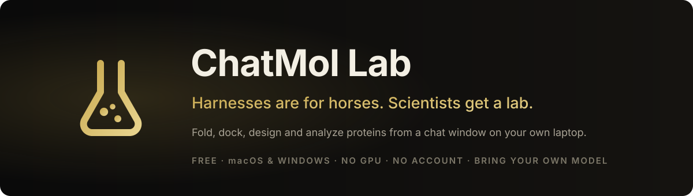

<p align="center">
  
</p>

<h1 align="center">Harnesses are for horses. Scientists get a lab.</h1>

<p align="center">
  ChatMol Lab is a free desktop agent for computational biology.<br>
  It folds, docks, designs and analyzes proteins from a chat window, on your own laptop, with no GPU.
</p>

<p align="center">
  <a href="https://github.com/ChatMol/chatmol-lab/releases"></a>
  <a href="LICENSE"></a>
  
  
</p>

<p align="center">
  <a href="https://github.com/ChatMol/chatmol-lab/releases"><b>Download for macOS</b></a> ·
  <a href="https://github.com/ChatMol/chatmol-lab/releases"><b>Download for Windows</b></a> ·
  <a href="docs/getting-started.md">Getting started</a> ·
  <a href="https://github.com/ChatMol/chatmol-lab/discussions">Discussions</a>
</p>

Your skills still run in Claude Code, Codex and DeepSeek Harness. We just don't make you live there.

## Ask it things like

> Fetch **1UBQ**, tell me its secondary structure composition, and show it in the viewer.

> Predict the complex of this nanobody with human **PD-L1** using Boltz-2, then report the interface residues and buried area.

> Design five binder backbones against the residues I selected, thread sequences with ProteinMPNN, and rank them by pLDDT.

> Dock this SMILES into the ATP pocket of **4HJO** with DiffDock and show me the top pose in PyMOL.

> Which human kinases in UniProt have a crystal structure with a bound inhibitor? Table with PDB IDs, please.

> Humanize this mouse antibody with WeMol and compare the CDRs to the original.

Every step is a real tool call you can expand, every file lands in a folder you chose, and the structures open in the built-in Mol\* viewer where you can click residues to send them back into the conversation.

## Why not just use a coding agent?

We tried. It knows what a PDB file is. It does not know what to do with one.

| The moment | A coding agent | ChatMol Lab |
|---|---|---|
| RFdiffusion renumbered every residue from 1 | Guesses an offset, gets `KeyError`, reports a 99 Å "contact" | `inspect_structure` reports the real ranges and maps your hotspots onto them |
| `import Bio` on a fresh machine | `ModuleNotFoundError`, then a pip detour | The runtime manifest tells the model what is installed before it imports |
| Fold, dock or design without a GPU | You wire up an API and its auth | Boltz-2, OpenFold2/3, RFdiffusion, ProteinMPNN, DiffDock, ColabFold MSA, GenMol, MolMIM, Evo2 through NVIDIA NIM, built in |
| "This loop, right here" | You paste residue numbers | Click residues in Mol\*, they attach to your message |
| A figure for the paper | Writes a PyMOL script and hopes | Drives a live PyMOL or ChimeraX window over MCP |
| Windows | Good luck with bioconda | Native conda runtime plus an offline WSL2 runtime for bioconda tools |
| Antibody humanization, ADMET, MD | Not available | WeMol's industrial modules with your own account |

Under the hood it borrows what works from the harnesses, on purpose: the same Agent Skills format (`SKILL.md`), the same `agents/*.md` subagent files, the same MCP servers, a file sandbox with a one-line justified retry, and a fast-model reviewer for shell commands. Read-only commands run, destructive ones ask.

## What's inside

**Compute without a GPU.** Structure prediction, complexes with ligands and nucleic acids, MSA, backbone generation, sequence design, docking, molecule generation and genome modeling through NVIDIA BioNeMo NIM. Industrial antibody and ADMET workflows through WeMol. Both with your own account.

**Structures you can point at.** Mol\* viewer with residue selection, `inspect_structure` and `analyze_structure` (secondary structure, superposition and RMSD, interface contacts and buried area, SASA, pLDDT / B-factor), and live PyMOL / ChimeraX control.

**Data and literature.** UniProt, PDB, PubMed, Ensembl, NCBI Gene, KEGG, Reactome, ChEMBL, PubChem, AlphaFold DB and 40 more, plus bioRxiv, Semantic Scholar and OpenAlex for literature.

**Your model, your machine.** OpenAI, Anthropic, Gemini, DeepSeek, OpenRouter or any OpenAI-compatible server such as Ollama, vLLM or LM Studio. Keys stay in your settings, files stay in the folder you picked, and there is no account to create. Sessions carry a cross-session memory so the lab remembers your project.

**Extend it.** Agent Skills, installable plugins from a folder or a git URL, parallel specialist subagents, and any stdio MCP server. Our own servers are packaged separately as [chatmol-mcp-servers](https://github.com/ChatMol/chatmol-mcp-servers) and our skills as [ChatMol-Skills](https://github.com/ChatMol/ChatMol-Skills), so they work in other harnesses too.

## Install

1. Download the installer for [macOS (Apple silicon)](https://github.com/ChatMol/chatmol-lab/releases) or [Windows (x64)](https://github.com/ChatMol/chatmol-lab/releases).
2. The installers are not notarized yet. macOS: right-click the app and choose **Open** the first time; on macOS 15 and later, open it once, then allow it under **System Settings → Privacy & Security**. Windows: **More info → Run anyway** in SmartScreen. Each release lists SHA-256 checksums.
3. Open Settings, paste one model key. Optionally add an NVIDIA NIM key for GPU tools and a WeMol account for industrial workflows.
4. Ask it something.

## Develop

```bash
git clone https://github.com/ChatMol/chatmol-lab.git
cd chatmol-lab
cp .env.example web/.env.local
npm install
cd web && npx prisma generate && npx prisma db push && cd ..
npm run dev            # http://localhost:3000
npm run electron:dev   # the desktop shell against the local app
```

Node.js 20 or newer. See [Getting started](docs/getting-started.md), [Desktop app](docs/desktop-app.md) and [Architecture](docs/architecture.md).

This repository is the desktop application and its shared agent runtime. It runs without any ChatMol account; the client side of optional ChatMol-operated services (session sync, the ChatMol Bio job API, the compute façade) is here, the services themselves are not.

## Contributing

Bug reports and focused pull requests are welcome; the easiest first contribution is a skill. Read [CONTRIBUTING.md](CONTRIBUTING.md) and [SECURITY.md](SECURITY.md) first. Never commit model keys or research data.

The installers bundle a conda runtime and other third-party components; see [THIRD_PARTY_NOTICES.md](THIRD_PARTY_NOTICES.md).

## License

[MIT](LICENSE)
